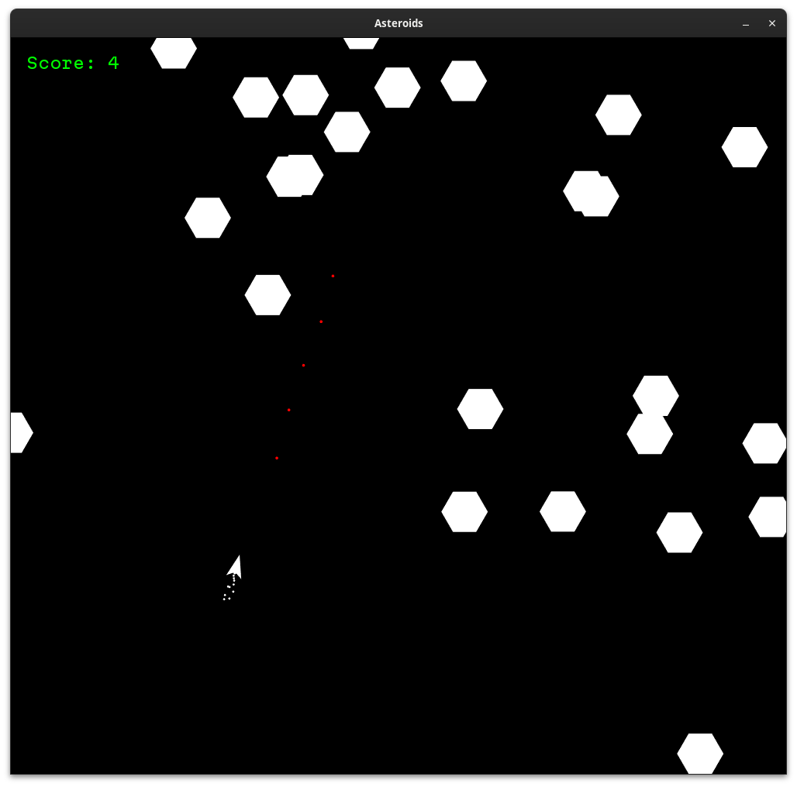

# Asteroids

Recreation of the asteroids game in sfml.

## Compile

In VSCode:
- Set Cmake Generator to use Ninja.
- Press `ctrl` + `s` in the CMakeLists.txt file to generate the ninja file.
- Press `shift` + `F5` to compile and run.

## Controls

- `W` : Move the ship forwards.
- `Mouse Cursor` : Rotate the ship.
- `Mouse Left` : Shoot.

*this game probably has a lot of memory leaks and bugs 😁.
